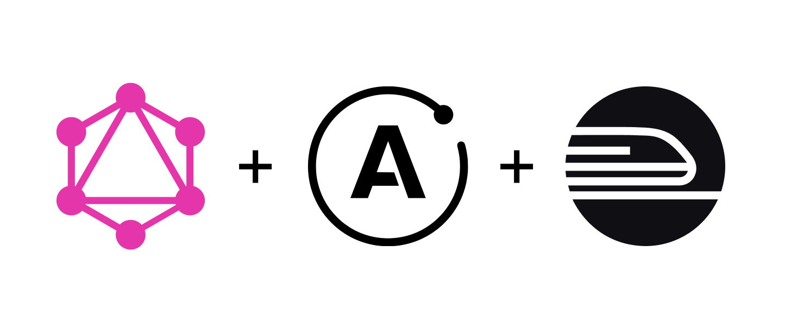

# GraphQL API with Apollo Server and Railway/Render



## Overview

This project is an example of how to create and deploy a GraphQL API using Apollo Server 4 and Railway.
It includes basic setup, resolvers, and is configured for easy development and deployment.

## Features

- **Apollo Server 4**: Uses the latest version of Apollo Server to create GraphQL APIs.
- **TypeGraphQL**: Defines the GraphQL schema using TypeScript decorators.
- **Railway Deployment**: Easily deployable using the Railway platform.
- **Class Validator**: Validates input data at the class level.

## Setup Instructions

### Prerequisites

- **Node.js**: Version 20 or higher.
- **Bun**: A fast all-in-one runtime for JavaScript and TypeScript.
- **Railway**: Account set up to deploy the application (optional).

### Installation

1. Clone the repository:

   ```bash
   git clone https://github.com/your-username/graphql-api-with-apollo-server-railway.git
   cd graphql-api-with-apollo-server-railway
   ```

2. Install dependencies:

   ```bash
   bun install
   ```

3. Configure environment variables. Create a .env file in the root of the project and add:
   ```bash
   PORT=4000
   ```

### Available Scripts

- `bun run dev`: Starts the server in development mode.
- `bun run dev:watch`: Starts the server in development mode with hot-reload.
- `bun run build`: Compiles TypeScript code to JavaScript.
- `bun run build:bun`: Compiles the code using Bun with minification.
- `bun run start`: Compiles and starts the server from the compiled code.

## Usage Examples

### Starting the Server

To start the server in development mode, use:

```bash
bun run dev
```

The server will be available at http://localhost:4000.

### Example Query

With the server running, you can make a GraphQL query. The following query uses the HelloWorldResolver:

```graphql
query ExampleQuery($message: String!) {
  log(message: $message)
}
```

Operation:

```json
{
  "message": "Hello, World!"
}
```

Expected response:

```json
{
  "data": {
    "log": "Hey there! This is the message: Hello, World!"
  }
}
```

This repository is part of the post written at https://dev.to/emunhoz/create-and-deploy-your-first-graphql-api-with-apollo-server-4-and-railway-2c3b
